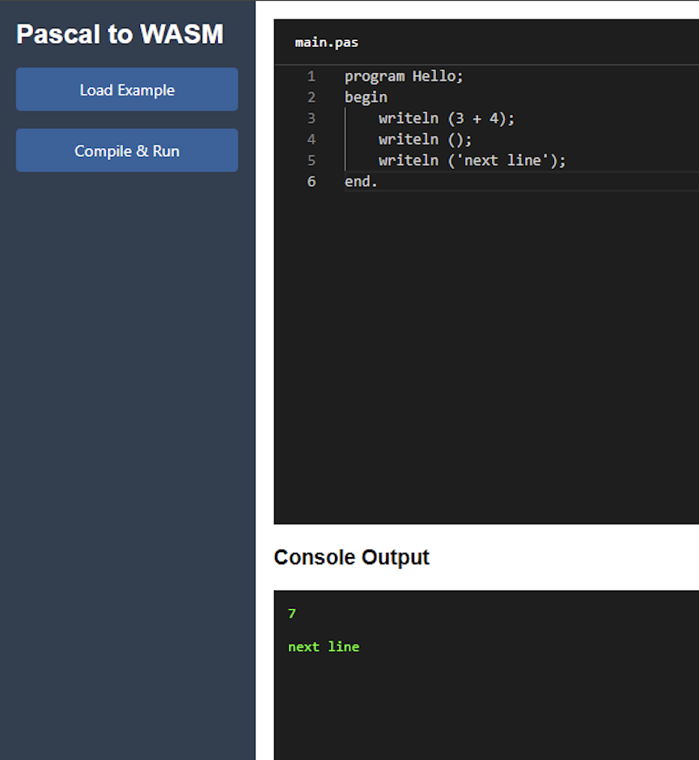

# COP5556-Project


This is a pseudo-delphi interpreter written utilizing ANTLR4 and Java. 

By [Gabriel Aldous](https://github.com/Sn00pyW00dst0ck) (70444594) & [Rishika Sharma](https://github.com/rishika64) (32772571)

## Video Walkthrough 

[](https://youtu.be/1luBAvlZxVQ)

## Project Setup 

> [!IMPORTANT]  
> This project was built using the following tools:
> ```
> Apache Maven 3.9.4 
> Java version: 23.0.0, vendor: Oracle Corporation
> ```

This project should build fine with another vendor's version of Java v23 provided that Apache Maven is properly setup.

Please ensure that these tools are downloaded before building the project. We recommend using the [asdf multiple runtime version manager](https://asdf-vm.com/) if you need to install multiple versions of Java.

In addition, this repository was built utilizing VS Code, and the setup/run instructions are created with this in mind. 
To build and execute utilizing VS Code, please install the [extension pack for Java](https://marketplace.visualstudio.com/items?itemName=vscjava.vscode-java-pack).

The following libraries are utilized:
1. [ANTLR4](https://www.antlr.org/) - to perform program file lexing and parsing.
2. [JLine](https://jline.org/) - to simplify reading input from the user within the CLI program, and to provide advanced features like command history via arrow keys.
3. [Big-Math](https://eobermuhlner.github.io/big-math/) - to support trigonometric, and other advanced mathematical operations on **BigDecimal** data type, which Java does not natively support. 
4. 

## Building the Project

When within the top level directory, VSCode should identify the Maven Java project. The `Explorer` tab should appear in the vertical toolbar to the left of VSCode. You can expand the `Maven` tab to view all of the available Maven lifecycle commands. Run the `package` lifecycle command to generate the ANTLR4 created classes, which are necessary for execution. This command will also run the unit tests for the project.

Alternatively, build the project from the command line by running the following command within the `./project` directory:
```
> cd project
> mvn clean package
```

After building the java project, initialize the backend web server dependencies by running these commands:
```
> cd project/web/src/main/resources
> npm i
```

VSCode has been setup such that when viewing any of the `.java` files within the `src` directory the run button will be available in the top left corner. This can be used to run the application either in normal or debug mode. 

### Using Command Line

Run the interpreter by executing:
```
java -jar target/cop5556-project.jar <options>
```

## Running Test Cases

All test files under `core/src/test/java/`:
- Unit tests: `ASTBuilderTest`, `InterpreterTest`, `OptimizerTest`, `CompilerTest`
- Integration tests: `CoreTest`
- Sample Pascal test cases for the interpreter and compiler, as well as expected outputs are within the core project's resouces folder.

This project includes unit tests to verify the functionality of the interpreter. For running Tests with Maven:
```bash
cd project/core
mvn test
```

## Project Overview

Below is the layout of the project. 

```
COP5556-Project/
├── .github/                          # CI/CD workflows and templates
├── .vscode/                          # VS Code workspace settings
├── project/
│   ├── pom.xml                       # Maven build file
│   ├── cli/
│   │   ├── src/main/java/plp/group/Main.java # CLI entry point
│   ├── core/
│   │   ├── main/
│   │   │   ├── antlr4/               # ANTLR grammar files
│   │   │   ├── java/
│   │   │   │   ├── AST/              # AST implementation (used by compiler only).
│   │   │   │   ├── Compiler/         # Compiler implementation
│   │   │   │   ├── Interpreter/      # Interpreter implementation
│   │   │   │   ├── Optimizer/        # Optimizer implementation
│   │   │   ├── resources/            # Test case files
│   │   ├── test/                     # Test cases for core
│   ├── web/                          # Java Springboot web server
│   │   ├── src/main/java/
│   │   ├── src/main/resources/       # Compilation resources for WASM
│   │   ├── src/main/resources/static # Served Website Files
```

## Core Components

### Grammar (ANTLR4)
Located in: `core/src/main/antlr4/plp/group/project/`

- `delphi.g4` — Parser rules for the Pascal subset
- `delphi_lexer.g4` — Lexical tokens (keywords, identifiers, literals)

### AST & Visitors
- `ASTBuilder.java` — Walks parse tree to build a custom AST
- `ASTVisitor.java` — Visitor pattern used for traversal
- `ASTBaseVisitor.java` — Base class for interpreter/compiler visitors

### Interpreter Logic

Key files:
- `Interpreter.java` — Main execution engine
- `RuntimeValue.java` — Type system and runtime object representation
- `Scope.java` / `Environment.java` — Variable scoping and resolution
- `LabelWalker.java` — Resolves `goto` labels for control flow
- `ControlFlowExceptions/` — Manages exceptions like `break`, `goto`, `return`

### Compiler & IR
- `IRBuilder.java` — Constructs low-level IR (Intermediate Representation)
- `StatementIRGenVisitor.java` — Translates AST to IR for most instructions
- `FunctionCollectionVisitor.java`, `StringCollectionVisitor.java` - collects all string literals / function and procedure definitions for separate processing
- `CompilerContext.java` - Tracks status for compilation and provides the `copmileToLLVM` compilation entry method.

### Optimizer
- `Optimizer.java` — Performs basic IR optimizations over the ANTLR4 parse tree

### Web UI

Path: `project/web`

- Java web servver built with Spring Boot
- Frontend in `static/`:
  - `index.html`, `editor.js`, `style.css`, `main.js`
- Backend:
  - `EndpointController.java` — REST controller for code evaluation
  - The web server uses the Makefile found in resources folder to compile received code into `.ll` files and then to `.wasm` files, placing the result in the `static/wasm/` folder for the frontend to query.




---

### Interpreter Logic

The approach taken for the **Interpreter** within P1 had some good elements, but the overly complex and difficult to maintain type system held back the project. The previous approach utilized inheritance and a unique class for each delphi type, which was not sustainable and clashed with parts of the language implementation (notably classes and objecct instantiation). 

This time, a different approach is utilized. We have abstracted *most* things which are calculated at program execution into a **RuntimeValue** interface, which has many classes implementing it. This abstraction allows for the creation of a `requireType` helper method which can properly cast a **RuntimeValue** into any specified Java class (or throw proper exceptions when not possible). This setup significantly simplifies the process of type checking for interpreter operations, and moves logic for operators out of individual classes and into the Interpreter itself, resulting in a more unified codebase. 

Furthermore, we have reworked the **Scope** class to utilize the **RuntimeValue** abstraction and to make it less likely to accidentally create unnecessary scopes. Additionally, an **Environment** class was created which provides an initial scope with implementations for many of the Pascal built in functions, including *write*, *writeln*, *read*, *readln*, and trigonometric/mathematical functions. 

### Static Scoping Support

Each new code block introduces a new scope that is chained to its parent scope:
- Global scope at the top level
- Nested scopes for:
   - Procedures/functions
   - Loop bodies (`for`, `while`, `repeat`)
   - Conditionals (`if`, `case`)
- Inner blocks can access variables from enclosing scopes (lexical/static scope)
- Functions/procedures see their own local variables and parameters, and global variables
- Shadowing is supported (a variable in inner scope can hide one in outer)

Scopes are implemented as a linked data structure where each scope has a reference to its parent, allowing efficient upward traversal during variable lookup.

### Optimizer Logic

The **Optimizer** class is new to this project and did not exist in the previous iteration. The **Optimizer** is a visitor which walks over the **ANTLR4** generated parse tree and performs a simple version of constant propagation. It does this by walking the tree and transforming the tree back into a string representation of the program, but interrupting the process during the evaluation of expressions so that any expressions formed of purely constant values may be pre-calculated, and the calculated outcome written instead. 

The re-written program string can then be re-parsed by **ANTLR4** and then ran utilizing the **Interpreter**. Since the **Interpreter** and **Optimizer** are completely independent, the CLI interface utilized to run the program can show parse trees when optimized or unoptimized, and allow interpretation when optimized or not optimized via command line argument flags.

The **Optimizer** is tested to ensure that it does not invalidate any valid program parse trees, and to ensure that calcualtions performed are correct.

### Compiler Logic

The **Compiler** component in this project primarily deals with the construction of an **Intermediate Representation (IR)** of the source program, which serves as a lower-level abstraction layer between the high-level Abstract Syntax Tree (AST) and eventual execution or optimization. This modular compiler design makes it easier to extend or modify backend targets in the future, including emitting LLVM IR, bytecode, or even binary executables. In the current implementation, it forms the backbone of the **IRBuilder** and the code generation path used for optimization and analysis.

#### Compiler Architecture

At a high level, the compiler operates using the following main items:

1. **AST Traversal** using the `StatementIRGenVisitor`, `StringCollectionVisitor`, and `FunctionCollectionVisitor`.
2. **Symbol Table Management** via `CompilerContext` and `SymbolTable`.
3. **IR Construction** with `LLVMValue`, and `IRBuilder`.

#### 1. AST Traversal

The core compilation is handled by the `StatementIRGenVisitor`, a visitor class that walks through the high-level AST nodes (such as variable declarations, assignments, conditionals, and loops) and translates them into low-level IR instructions.

**Key Responsibilities:**
- Emits `alloca` instructions for variable declarations.
- Generates SSA-style instructions (`%register = op arg1 arg2`) for expressions.
- Encodes control flow (conditional branches, jumps).
- Manages function entry and return code generation.
- Supports nested scopes, procedure bodies, and parameter passing.

This constructs a typed memory allocation instruction and adds it to the IR stream.

#### 2. Symbol Table & Type Management

The `CompilerContext` is the orchestrator of the IR generation phase. It maintains:
- The current symbol table (`SymbolTable`) used to resolve identifiers
- A type system mapping identifiers to LLVMValue types
- A label and register allocator for unique naming

**SymbolTable** supports:
- Nested scopes
- Variable declaration and shadowing
- Type resolution and conflict detection

This makes it possible for the compiler to properly generate typed operations and reference variables across scopes, including functions and class methods.

#### 3. IR Construction

The `IRBuilder` is the low-level utility that accumulates IR strings (effectively a textual IR buffer) while visiting the AST. It essentially acts as a wrapper around multiple forms of java `StringBuilder` so that we can add to different segments of the LLVM IR (ex add a new global string vs a new instruction in a function).

#### `LLVMValue`
A set of classes under `LLVMValue` abstracts:
- Registers (e.g., `%r1`)
- Constants (e.g., `i32 5`)
- Functions (user defined and built in ones like `writeln`)

This abstraction separates type-handling and register allocation logic from syntax, allowing reuse and ensuring all IR follows LLVM-style conventions.

## What Is Implemented

The following items have been implemented within this version of the project: 

1. `delphi.g4` and `delphi_lexer.g4` grammar files properly parse class definitions and usages.
2. A robust command line interface for utilizing the **Interpreter**, **Optimizer**, and **Compiler**.
3. A java web server and HTML/CSS/JS website capable of acting as a frontend web editor which can run the programs within the browser using `.WASM`.
4. Implemented an **Optimizer** capable of performing a simplified variation of constant propogation.
    - Operations with constant literal values are evaluated as much as possible.
    - Calculations involving more complex items such as variables, procedure and function calls, and other complex structures are NOT evaluated. 
5. An interpreter with support for:
    - Built in functions/procedures: *write* ,*writeln* ,*read* - NOTE: currently only works for reading integers - *readln* - NOTE: currently only works for reading integers - *Exit* - equivalent of return statement as defined by Pascal - *Continue* ,*Break* ,*arctan* ,*chr* ,*cos* ,*exp* ,*ln* ,*odd* ,*pi* ,*round* ,*sin* ,*sqrt* ,*trunc*
    - Interpret expressions. 
    - Interpret statements: while loops, for loops, repeat until loops, case statement, procedure call statement, goto statement - NOTE: only works on simple cases! - return, break, and continue statements - last three through built in procedures as is consistent with Pascal
    - Implemented the ability for users to define custom procedures and functions. 
        - Parameters may be passed by value or by reference. 
        - Parameters passed by reference are correctly modified outside of the function call.
        - Currently, parameters defined to be `PROCEDURE` or `FUNCTION` type are unsupported. 
    - Implemented *basic* class and object operations. 
        - Constructor call on object creation.
        - Field access
        - Class methods - as a procedure or function, with ability to pass by value or reference
        - Nested accesses
    - Ability to perform calculations utilizing Enumerations, including looping over them and using them in case statement conditions.
    - Note: if something is not listed as supported here, safely assume that it is not supported or has minimal implementation in the Interpreter.
6. A compiler with support for:
    - Compiling expressions (so long as the expression would not need a type cast).
    - Compiling statements (all statements except the `with` statement).
        - Note: for loops are limited to looping over integers.
    - Compiling user defined functions and procedures (no support for pass by reference).
    - Built in functions/procedures: *write*, *writeln*, *arctan*, *cos*, *exp*, *ln* ,*odd*, *round*, *sin*, *sqrt*, *trunc*
    - Note: if something is not listed as supported here, safely assume that it is not supported or has minimal implementation in the Compiler.
7. Unit tests for nearly all of the above mentioned features.

## Bonus Implementations

The compilation of `.ll` to `.wasm` relies on the [TWR WASM LIBRARY](https://twiddlingbits.dev/docsite/). The web server will invoke a `Makefile` to compile the `.ll` to `.wasm` and then serve this module to the frontend. The frontend website will load this module and then run the program in the browser. See below for images of the outputs.


## References

The following online resources were utilized during the construction of this application.

1. https://docwiki.embarcadero.com/RADStudio/Athens/en/Delphi_Language_Reference
2. https://www.tutorialspoint.com/compile_pascal_online.php
3. https://www.onlinegdb.com/online_pascal_compiler
4. https://ssw.jku.at/General/Staff/ManuelRigger/thesis.pdf
5. https://www.antlr.org/api/
6. https://www.baeldung.com/java-antlr
7. https://www.oracle.com/technical-resources/articles/java/javareflection.html
8. https://docs.oracle.com/en/java/javase/23/
9. https://eobermuhlner.github.io/big-math/
10. https://jline.org/
11. https://www.freepascal.org/docs-html/rtl/system/writeln.html
12. https://www.dcs.ed.ac.uk/home/SUNWspro/3.0/pascal/lang_ref/ref_builtin.doc.html
13. https://www.freepascal.org/docs-html/rtl/system/index-5.html
14. https://twiddlingbits.dev/docsite/
15. https://mapping-high-level-constructs-to-llvm-ir.readthedocs.io/en/latest/a-quick-primer/index.html
16. https://godbolt.org/
17. https://llvm.org/docs/CommandGuide/llc.html
18. https://llvm.org/docs/LangRef.html
